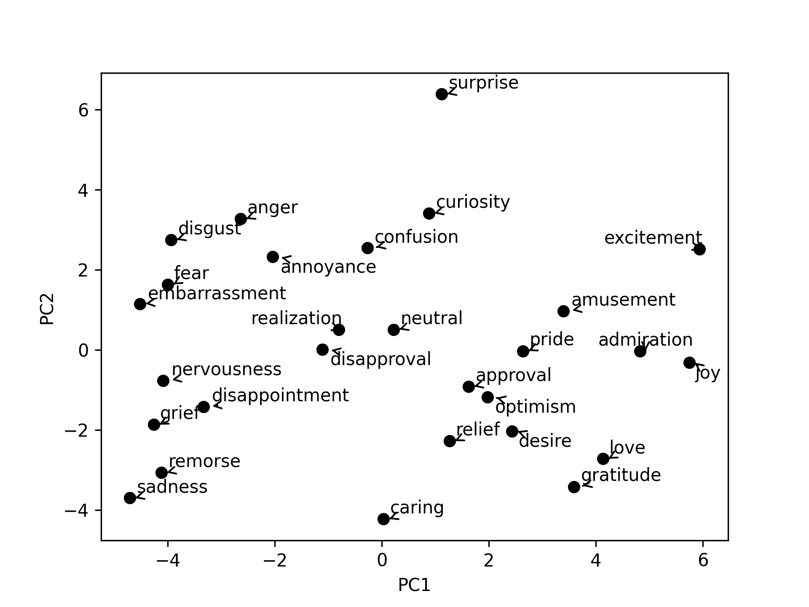

**🌟 Emotion Decomposition via Word Embeddings 🌟**

---

✨ **Description:**

Welcome to the **_programming core_** of our groundbreaking research! Dive deep into the realm of human emotions, unraveled through the sophisticated power of word embeddings and extracted from the pulsating world of Reddit.

**🔍 Highlights:**

- **🌐 Dataset Source:** Utilized a fascinating Reddit dataset GoEmotions developed by Google https://huggingface.co/datasets/go_emotions

- **🧠 Methodology:** Our state-of-the-art approach involves meticulously crafting emotion vectors, offering a window into the multifaceted dimensions of emotional experiences hidden within the tapestry of human language.

- **📚 Key Findings:** Breaking boundaries, our research champions word embeddings' ability to parallel emotional components previously documented, but without the constraints of age-old theoretical frameworks.

- **🚀 Implications & Future Directions:** Embarking on this pioneering odyssey, we spotlight the boundless potential of word embeddings in decoding human emotions. Envision a future where psychology intertwines seamlessly with cutting-edge tech, deepening our collective grasp on emotional constructs in real-world, data-driven scenarios.

---
**A plot of the first two PCA dimensions**  
  

---
🔗 Dive into our code, and immerse yourself in transformative findings. Together, let's navigate this riveting confluence of human emotion and advanced NLP! 🌌

Your feedback? It's not just welcomed; it's **_celebrated_**. Let's collaborate, innovate, and redefine the frontiers of psychological research. 🎉🚀

---

**📂 Repository Structure & Description:**

- **`data`**: Houses the datasets and phrasers used in the project.
    - `goemotions.csv`: The primary dataset containing emotions.
    - `phraser_bigrams`: Contains bigram phrasers used in Emo2Vec training.
    - `phraser_trigrams`: Contains trigram phrasers, representing three-word combinations.
    - **`splits`**: Contains different splits or subsets of the dataset for robust testing and validation.
        - `corpus1.csv` and `corpus2.csv`: Split datasets.
        - `phraser_bigrams1/2` and `phraser_trigrams1/2`: Split phrasers.

- **`models`**: Contains the results and distance metrics of models trained on the dataset.
    - `distance.csv`: A file with the analyzed distances between Emotional Vectors under different model hyperparameters.
    - `models1` and `models2`: Different model configurations used in the naalysis.

- **`plots`**: Contains visual representations of the emotional vectors.
    - Various `pca*.png` files: Visual plots representing data projections or clusters.

- **`scripts`**: Contains Python scripts for various tasks throughout the project.
    - `check_allignment.py`: Checks the alignment of the Emotional Vectors with known emotional dimensions.
    - `creating_plots.py`: Script to generate plots for visual analysis.
    - `exploration.py`: Script for exploratory data analysis.
    - `horns_analysis.py`: Performs Horn's analysis, possibly related to factor analysis.
    - `stemming_multi_threading.py`: A script that applies stemming to text data using multi-threading for efficiency.
    - `training_embeddings.py`: Script to train word embeddings on the dataset.
    - **`robustness_test`**: Contains scripts specific to testing the robustness of the embeddings or models.
        - `creating_plots_robustness.py`: Generates plots for robustness testing.
        - `training_embeddings_robustness.py`: Trains embeddings under various conditions for robustness checks.
